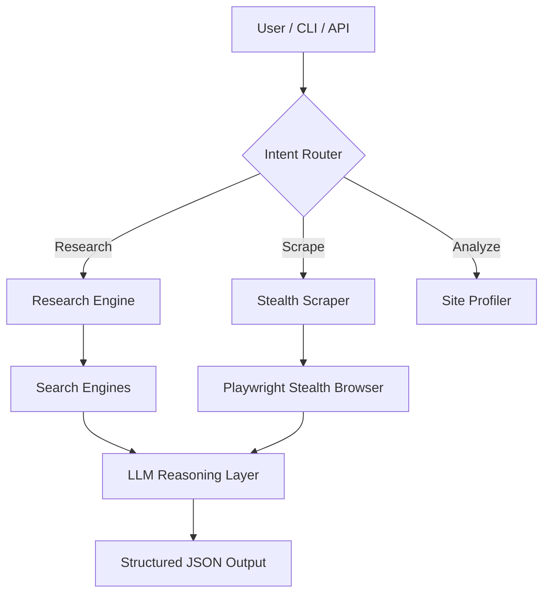

<div align="center">

# ╔══════════════════════════════════════════════════════════════╗

# ║                       **URWA BRAIN v3.5**                    ║

# ╚══════════════════════════════════════════════════════════════╝

### 🚀 AI-Powered Autonomous Research & Stealth Scraping Engine

**From simple queries to multi-stage intelligence pipelines — fully automated.**


</div>

---

## 🧠 What is URWA Brain?

**URWA Brain** is an **agent-driven research and scraping platform** that understands intent, adapts its strategy, and delivers **structured intelligence** — not just raw HTML.

It automatically decides:

* *Should I research or scrape?*
* *Is this site protected?*
* *Do I need stealth browsing?*
* *Should I use local AI or cloud LLMs?*

And then executes the **entire pipeline autonomously**.

---

## ⚡ Quick Start

Launch the **URWA Terminal Interface** in one command.

```bash
# Windows
urwa sans start
```

```bash
# Linux / macOS / Git Bash
./urwa sans start
```

> This bootstraps the environment, verifies dependencies, and launches the AI Agent.

---

## ✨ Core Capabilities

| Capability                 |  Status  | What it actually does                                     |
| -------------------------- | :------: | --------------------------------------------------------- |
| **Intent-Aware Agent**     | ✅ ACTIVE | Understands *research vs scrape vs analyze* automatically |
| **Ultra-Stealth Scraping** | ✅ ACTIVE | Defeats 403s, bot protection, Cloudflare, JS challenges   |
| **Deep Research Mode**     | ✅ ACTIVE | Multi-query web search → synthesis → citations            |
| **Site Intelligence**      | ✅ ACTIVE | Profiles protection level before execution                |
| **Private AI Mode**        | ✅ ACTIVE | Fully local LLM via **Ollama** (Phi-3, Llama-3)           |
| **Hybrid LLM Routing**     | ✅ ACTIVE | Switch between Ollama / Groq / OpenAI                     |
| **API-First Design**       | ✅ ACTIVE | REST API + Swagger UI                                     |

---

## 🏗️ System Architecture



---

## 📦 Installation & Setup

### Option A — One-Command CLI (Recommended)

Just run:

```bash
urwa sans start
```

Everything is handled automatically.

---

### Option B — Manual Setup

#### 1. Clone & Environment

```bash
git clone https://github.com/yourusername/urwa-brain.git
cd urwa-brain
python -m venv venv
```

Activate:

```bash
# Windows
venv\Scripts\activate

# Linux / macOS
source venv/bin/activate
```

---

#### 2. Install Dependencies

```bash
cd backend
pip install -r requirements.txt
playwright install chromium
```

---

#### 3. Configure AI Providers

**Local (Private AI)**

```bash
ollama pull phi3:mini
```

**Cloud (High-Speed)**
Set in your environment:

```bash
GROQ_API_KEY=your_key_here
```

---

## 🔌 API Usage

Backend runs on **`http://localhost:8000`**

### 🧠 Unified Agent Endpoint

`POST /api/v1/agent`

#### Request

```json
{
  "input": "Find the pricing of iPhone 15 Pro Max on amazon.com and compare with apple.com",
  "use_ollama": true
}
```

#### Response

```json
{
  "intent": "scrape",
  "action_taken": "Scraped 2 sources",
  "result": {
    "structured_data": {
      "amazon_price": "$1199",
      "apple_price": "$1199",
      "verdict": "Prices are identical"
    }
  }
}
```

---

## 🗂️ Project Structure

```text
urwa-brain/
├── backend/
│   ├── app/
│   │   ├── main.py              # FastAPI entrypoint
│   │   ├── agents/             # Autonomous agents
│   │   ├── services/           # Orchestration layer
│   │   ├── strategies/         # Stealth + bypass logic
│   │   └── utils/              # Parsers, rankers, analyzers
│   └── requirements.txt
│
├── terminal/
│   └── cli.py                  # Rich CLI interface
│
├── docs/                       # Architecture & API docs
├── docker-compose.yml
├── urwa.cmd                    # Windows launcher
├── urwa                        # Linux/macOS launcher
└── README.md
```

---

## 🧩 Use-Cases

* 🔎 **Market Intelligence** – competitor pricing, feature comparison
* 📰 **OSINT & Research** – multi-source verification
* 🧪 **Data Extraction** – from JS-heavy protected sites
* 🤖 **AI Pipelines** – plug into agents, workflows, MCP servers
* 🏫 **Academic Projects** – real-world autonomous systems

---

## 🛡️ Compliance & Ethics

URWA Brain is built with:

* Respect for **robots.txt** (configurable)
* Rate limiting & adaptive crawling
* No built-in misuse tooling
  You control *where* and *how* it is used.

---

## 🛣️ Roadmap

* [ ] MCP Server integration
* [ ] n8n workflow triggers
* [ ] Visual agent dashboard
* [ ] Distributed crawling nodes
* [ ] Persistent knowledge graph

---

<div align="center">

### **Built for Speed. Engineered for Stealth. Designed for Intelligence.**

[🐞 Report Bug](#) • [✨ Request Feature](#) • [📖 Docs](#)

</div>

