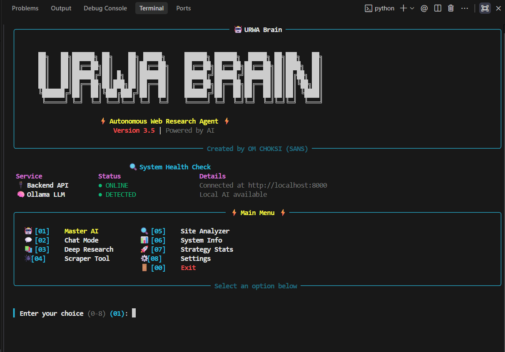
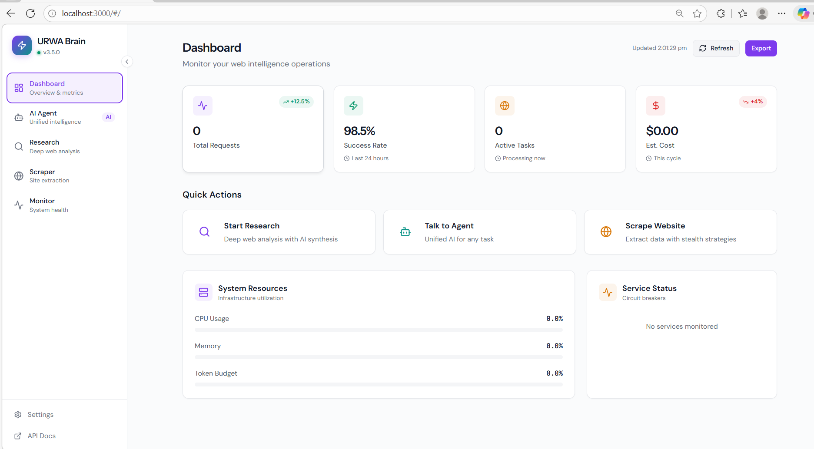
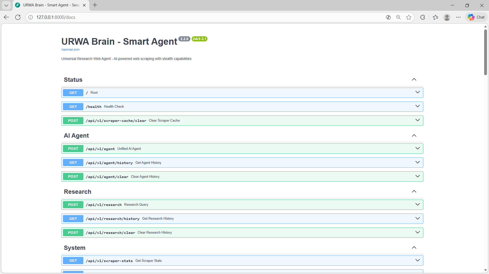
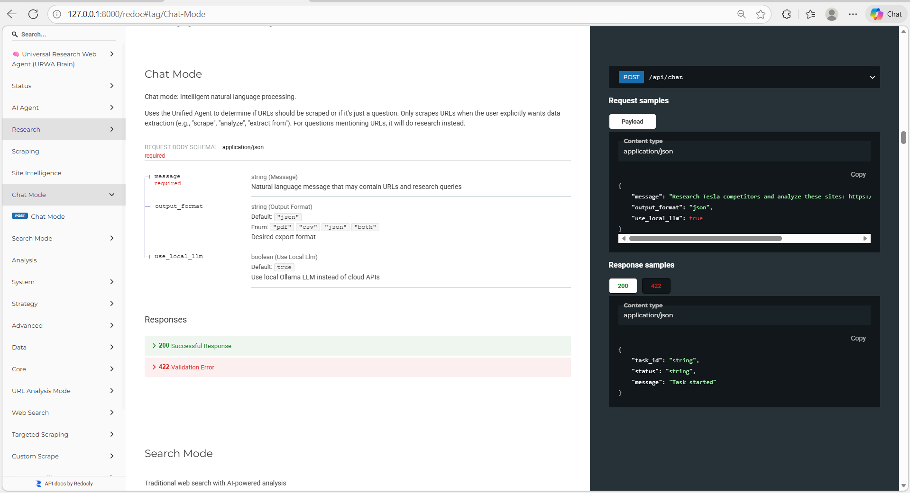
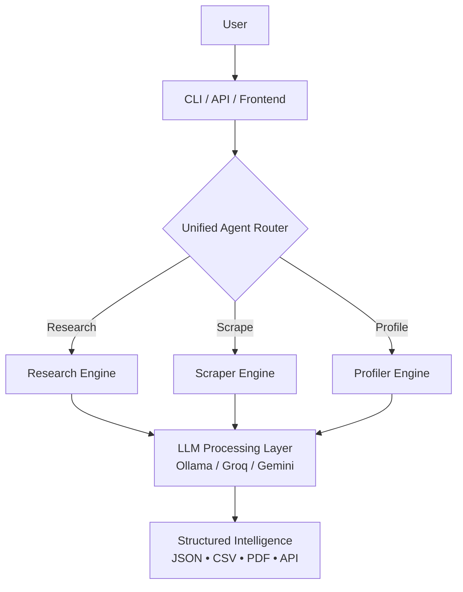
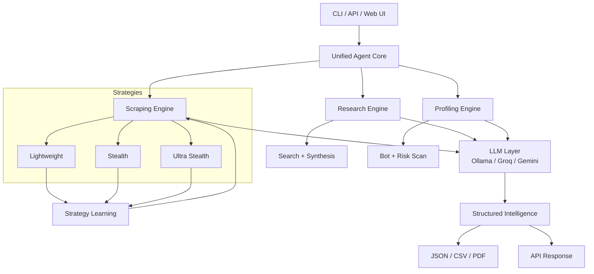

<div align="center">

╔══════════════════════════════════════════════════════════════════════╗
║                                                                      ║
║                          URWA BRAIN v3.5                             ║
║               AI-Powered Autonomous Research Engine                  ║
║                                                                      ║
╚══════════════════════════════════════════════════════════════════════╝


[](LICENSE)
[](docs/index.md)

**URWA Brain is an intelligent autonomous research and scraping engine that understands intent, adapts its strategy, and delivers structured intelligence — not raw HTML.**

[Quick Start](#quick-start) • [Docs](docs/index.md) • [API](http://localhost:8000/docs) • [CLI](terminal/README.md)

</div>

---

# What Makes URWA Different?

URWA Brain is **not just a scraper**.  
It is an **agentic research system** that decides *how* to solve a task.

### Core Capabilities

- **Intent-Aware Agent** – understands whether you want to research, scrape, analyze, or compare
- **Ultra-Stealth Scraping** – bypasses Cloudflare & bot detection safely
- **Deep Research Mode** – multi-source search + AI synthesis + citations
- **Local & Cloud AI** – Ollama for privacy, Groq/Gemini for speed
- **Strategy Learning** – adapts scraping method per domain
- **CLI + REST API** – terminal-first + production-ready backend

---

# Quick Start

### One Command

**Windows**
```powershell
urwa sans start

```

**Linux / macOS**

```bash
./urwa sans start

```

Starts:

* FastAPI backend
* Interactive CLI
* Strategy learning engine

---

# Try It

```bash
urwa research "Latest AI agent frameworks"
urwa scrape [https://example.com](https://example.com)
urwa profile [https://amazon.com](https://amazon.com)

```

---

# Screenshots & Demo

## Terminal Interface

<div align="center">
  
  <p><em>Professional CLI with Master AI mode, research capabilities, and real-time status</em></p>
</div>

## Frontend Dashboard

<div align="center">
  
  <p><em>Modern web interface with system metrics, agent console, and monitoring</em></p>
</div>

## System Monitoring

<div align="center">
  
  <p><em>Real-time system health, circuit breakers, and performance metrics</em></p>
</div>

## API Documentation

<div align="center">
  
  <p><em>Interactive API documentation with Swagger UI</em></p>
</div>

<div align="center">
  
  <p><em>Beautiful API documentation with ReDoc</em></p>
</div>

---

# Architecture (High Level)



---

# Installation

## Prerequisites

* Python 3.11+
* 4GB RAM minimum
* Git

## Setup

```bash
git clone [https://github.com/OMCHOKSI108/urwa-brain.git](https://github.com/OMCHOKSI108/urwa-brain.git)
cd urwa-brain

python -m venv venv
source venv/bin/activate  # Windows: .\venv\Scripts\activate

cd backend
pip install -r requirements.txt
playwright install chromium

```

### Optional: Local AI

```bash
ollama pull phi3:mini

```

---

# Configuration

Create `backend/.env`

```env
GROQ_API_KEY=your_key
GEMINI_API_KEY=your_key

OLLAMA_BASE_URL=http://localhost:11434
OLLAMA_MODEL=phi3:mini

PORT=8000
RATE_LIMIT=20/minute
MAX_RETRIES=3

```

---

# Three-Level Scraping Strategy

| Level | Mode | Use Case | Success Rate |
| --- | --- | --- | --- |
| 1 | Lightweight | Blogs, docs | ~60% |
| 2 | Stealth | Protected sites | ~85% |
| 3 | Ultra-Stealth | Heavy bot walls | ~95% |

URWA **automatically escalates** if a strategy fails.

---

# API Overview

Base URL → `http://localhost:8000`

## Unified Agent

```http
POST /api/v1/agent

```

```json
{
  "input": "Compare iPhone 15 prices on Amazon and Apple",
  "use_ollama": true
}

```

### Response

```json
{
  "status": "success",
  "intent": "scrape",
  "confidence": 0.95,
  "action_taken": "Ultra-stealth scraping",
  "result": {
    "amazon_price": "$1199",
    "apple_price": "$1199"
  }
}

```

---

# Core Endpoints

| Endpoint | Method | Purpose |
| --- | --- | --- |
| `/api/v1/agent` | POST | Unified AI agent |
| `/api/v1/research` | POST | Deep research |
| `/api/v1/scrape` | POST | Direct scraping |
| `/api/v1/profile` | GET | Site protection |
| `/api/v1/stats` | GET | System metrics |
| `/docs` | GET | Swagger UI |

---

# CLI Power Features

```bash
urwa stats
urwa logs --tail
urwa research "AI regulation" --export pdf
urwa scrape [https://site.com](https://site.com) --export json

```

---

# System Architecture



---

# Roadmap

* [ ] RAG memory store
* [ ] Workflow automation
* [ ] Browser extension
* [ ] Multi-agent collaboration
* [ ] Cloud deployment templates

---

# License

MIT — see [LICENSE](https://www.google.com/search?q=LICENSE)

---

<div align="center">

**Built for Speed. Engineered for Stealth. Designed for Intelligence.**

</div>

```

